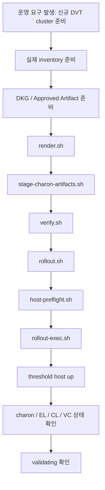

# DVT Cluster Walkthrough

## 목적

이 문서는 운영자가 신규 DVT cluster를 준비해서 실제로 validating 상태까지 올리는 과정을
하나의 예시 시나리오로 설명하는 문서다.

핵심 질문은 아래다.

- 이 레포를 실제 운영 절차에서 어떻게 쓰는가
- 신규 cluster 준비부터 validating 확인까지 어떤 순서로 움직이는가
- 이 레포가 자동화해 주는 것과 사람이 직접 책임져야 하는 것은 무엇인가

이 문서는 "실제 작업 순서"를 기준으로 읽으면 된다.

함께 보면 좋은 문서:

- `docs/reading-order.md`
- `docs/runtime-inventory-guide.md`
- `docs/runtime-secrets-guide.md`
- `docs/web3signer-kms-guide.md`
- `docs/approval-audit-guide.md`
- `docs/observability-alerting-guide.md`
- `docs/bring-up-checklist.md`

## 시나리오 가정

아래와 같은 상황을 가정한다.

- 네트워크: `mainnet`
- cluster 이름: `treasury-mainnet-obol-a`
- operator host 수: 4
- threshold: 3-of-4
- runtime baseline: Obol `charon-distributed-validator-node`
- signer 경로: Web3Signer + KMS
- treasury execution account: Safe multisig

host 이름은 예시로 아래를 사용한다.

- `operator-1`
- `operator-2`
- `operator-3`
- `operator-4`

## 먼저 알아야 할 중요한 사실

이 레포가 신규 cluster를 만들 때 자동으로 해주지 않는 것도 있다.

### 이 레포가 해주는 것

- host별 runtime bundle render
- approved `.charon` artifact stage
- runtime verify
- rsync rollout
- host preflight
- remote compose 실행

### 이 레포가 아직 직접 안 해주는 것

- 실제 DKG ceremony 수행
- 실제 deposit submit
- Web3Signer/KMS 실인증 연동 세부 구현
- rollback 자동화
- validating 여부의 완전 자동 판정

즉, 이 레포는 "운영 절차를 안전하게 이어주는 control plane / automation 뼈대"이지,
모든 것을 완전 자동으로 끝내는 마법 툴은 아니다.

## 이 시나리오의 전체 타임라인



## 단계 0. 준비물

이 시나리오를 실제로 수행하려면 최소한 아래가 준비되어 있어야 한다.

### 운영 정보

- cluster 이름
- network
- threshold
- 4대 host의 주소
- 4대 host의 SSH user
- 4대 host의 deployment path

### runtime 외부 의존성

- 4대 bare-metal host
- Docker / Docker Compose
- Web3Signer
- KMS
- approved DKG / cluster artifact

### 승인 입력

최소 두 종류의 approval이 분리되어야 한다.

- `.charon` artifact stage approval
- rollout approval

이 분리가 중요한 이유는,
artifact 승인과 실제 서버 배포 승인을 같은 것으로 취급하면
통제 경계가 흐려지기 때문이다.

## 단계 1. inventory를 준비한다

현재 이 레포는 `cluster.yml`, `hosts.yml` 기본값을 자동으로 읽는 단계까지는 아직 가지 않았다.
그래서 현재 시점에서는 파일 경로를 명시적으로 넘기는 방식으로 쓴다.

보통 아래처럼 시작하면 된다.

```bash
cp infra/obol-cdvn/inventory/cluster.example.yml /secure/config/cluster.yml
cp infra/obol-cdvn/inventory/hosts.example.yml /secure/config/hosts.yml
```

그리고 실제 값으로 수정한다.

`cluster.yml`에는 최소한 아래가 들어간다.

- `name`
- `network`
- `baselineVersion`
- `overlayProfiles`
- `threshold`
- `operatorCount`
- `web3signerUrl`
- `deploymentRoot`
- `approvalPolicy`

`hosts.yml`에는 host별로 아래가 들어간다.

- `name`
- `address`
- `sshUser`
- `deploymentPath`
- `charonExternalHostname`
- `monitoringPeer`

### 초보자가 여기서 자주 하는 실수

- `baselineVersion`을 pinned baseline과 다르게 적는다.
- host별 `deploymentPath`를 비워 둔다.
- SSH user와 host address를 나중에 넣겠다고 미룬다.

inventory는 단순 메모가 아니라,
이후 render와 rollout이 의존하는 실행 입력이다.

## 단계 2. approved artifact를 준비한다

이 단계는 "DKG가 완료되어 runtime에 필요한 cluster artifact가 승인된 상태"를 의미한다.
"DKG Ceremony" 는 수동으로 세팅해야한다.

현재 `web3signer` overlay 기준으로 runtime에 들어갈 수 있는 것은 아래뿐이다.

- `cluster-lock.json`
- `charon-enr-private-key`
- optional `validator-pubkeys.txt`

보통 host별 source dir는 아래처럼 둔다.

```text
/secure/approved-artifacts/
  operator-1/
    .charon/
      cluster-lock.json
      charon-enr-private-key
    validator-pubkeys.txt
  operator-2/
    .charon/
      cluster-lock.json
      charon-enr-private-key
    validator-pubkeys.txt
  operator-3/
    .charon/
      cluster-lock.json
      charon-enr-private-key
    validator-pubkeys.txt
  operator-4/
    .charon/
      cluster-lock.json
      charon-enr-private-key
    validator-pubkeys.txt
```

여기서 중요한 점:

- `cluster-lock.json`은 cluster 전체에 공통일 수 있다.
- `charon-enr-private-key`는 host별로 다르다.
- `validator_keys/`나 keystore는 stage 대상이 아니다.

### approval 파일도 준비한다

artifact stage approval 예시는 아래 파일 형식을 참고한다.

- `infra/obol-cdvn/scripts/charon-artifact-approval.example.env`

rollout approval 예시는 아래를 참고한다.

- `infra/obol-cdvn/scripts/rollout-approval.example.env`

실제 운영에서는 host별 approval 파일을 분리하는 것이 맞다.

예시:

```text
/secure/approvals/
  operator-1-charon-stage.env
  operator-1-rollout.env
  operator-2-charon-stage.env
  operator-2-rollout.env
  ...
```

## 단계 3. host별 rendered bundle을 만든다

이제 inventory를 바탕으로 host별 runtime bundle을 만든다.

```bash
infra/obol-cdvn/scripts/render.sh \
  --cluster-file /secure/config/cluster.yml \
  --hosts-file /secure/config/hosts.yml \
  --output-dir .tmp-cdvn-cluster-render \
  --force
```

성공하면 아래 같은 구조가 생긴다.

```text
.tmp-cdvn-cluster-render/
  render-bundle.env
  hosts/
    operator-1/runtime/
    operator-2/runtime/
    operator-3/runtime/
    operator-4/runtime/
```

이 시점의 bundle은 아직 deploy-ready가 아니다.

왜냐하면:

- `.charon` artifact가 아직 비어 있고
- `jwt/jwt.hex`도 아직 없고
- 실제 host preflight도 아직 하지 않았기 때문이다.

## 단계 4. approved `.charon` artifact를 stage 한다

각 host runtime에 approved artifact를 stage 한다.

### dry-run으로 먼저 본다

```bash
infra/obol-cdvn/scripts/stage-charon-artifacts.sh \
  --render-dir .tmp-cdvn-cluster-render \
  --host-name operator-1 \
  --approval-file /secure/approvals/operator-1-charon-stage.env \
  --source-dir /secure/approved-artifacts/operator-1
```

이 dry-run은 아래를 보여준다.

- 어떤 source dir를 읽는지
- 어떤 파일이 runtime에 들어갈지
- 어떤 파일이 무시되는지
- 기존 staged 파일이 있어서 `--force`가 필요한지

### 실제 stage를 실행한다

```bash
infra/obol-cdvn/scripts/stage-charon-artifacts.sh \
  --render-dir .tmp-cdvn-cluster-render \
  --host-name operator-1 \
  --approval-file /secure/approvals/operator-1-charon-stage.env \
  --source-dir /secure/approved-artifacts/operator-1 \
  --execute
```

이 작업을 `operator-1`부터 `operator-4`까지 반복한다.

### 이 단계가 끝나면 생기는 것

예를 들어 `operator-1` runtime에는 아래가 생긴다.

- `.charon/cluster-lock.json`
- `.charon/charon-enr-private-key`
- optional `validator-pubkeys.txt`
- `charon-artifacts-staging.env`

`charon-artifacts-staging.env`는 매우 중요하다.

이 파일에는 아래가 기록된다.

- approval id
- source path
- sha256
- staged 시각

즉, "어떤 approved artifact를 언제 stage 했는지"를 나중에 추적할 수 있다.

## 단계 5. staged bundle을 verify 한다

artifact stage가 끝나면 verify를 다시 돌린다.

```bash
infra/obol-cdvn/scripts/verify.sh \
  --render-dir .tmp-cdvn-cluster-render
```

이 단계에서 확인하는 것은 대략 아래다.

- baseline 버전 일치
- overlay 반영 여부
- `WEB3SIGNER_URL` 존재 여부
- staged `.charon` 파일 존재 여부
- `web3signer` overlay인데 `.charon/validator_keys`가 들어가지 않았는지

이 단계가 실패하면 rollout으로 넘어가면 안 된다.

## 단계 6. rollout dry-run을 본다

이제 rendered runtime을 각 host deployment path로 보낼 준비를 한다.

먼저 dry-run:

```bash
infra/obol-cdvn/scripts/rollout.sh \
  --render-dir .tmp-cdvn-cluster-render \
  --host-name operator-1 \
  --approval-file /secure/approvals/operator-1-rollout.env
```

필요하면 destination을 명시할 수도 있다.

```bash
infra/obol-cdvn/scripts/rollout.sh \
  --render-dir .tmp-cdvn-cluster-render \
  --host-name operator-1 \
  --approval-file /secure/approvals/operator-1-rollout.env \
  --destination ubuntu@203.0.113.11:/opt/obol/treasury-mainnet-obol-a
```

dry-run에서 확인할 것은 아래다.

- approval cluster / host / policy가 맞는지
- rsync 대상 경로가 맞는지
- 예상 변경 파일이 무엇인지

## 단계 7. host preflight를 돌린다

rollout 직전, 실제 host가 배포 준비가 되었는지 본다.

### dry-run

```bash
infra/obol-cdvn/scripts/host-preflight.sh \
  --render-dir .tmp-cdvn-cluster-render \
  --host-name operator-1
```

### execute

```bash
infra/obol-cdvn/scripts/host-preflight.sh \
  --render-dir .tmp-cdvn-cluster-render \
  --host-name operator-1 \
  --execute
```

현재 preflight가 확인하는 것은 아래다.

- `docker`
- `docker compose`
- `rsync`
- `curl`
- deployment path writable
- 최소 disk 여유

필요하면 required file도 넣을 수 있다.

```bash
infra/obol-cdvn/scripts/host-preflight.sh \
  --render-dir .tmp-cdvn-cluster-render \
  --host-name operator-1 \
  --required-file /opt/obol/treasury-mainnet-obol-a/secrets/web3signer-client.pem \
  --execute
```

### 여기서 멈춰야 하는 경우

아래 중 하나라도 나오면 execute 단계로 넘어가면 안 된다.

- docker compose 없음
- deployment path write 불가
- disk 부족
- required file 없음

## 단계 8. 실제 rollout을 수행한다

preflight가 끝났으면 runtime bundle을 대상 host로 보낸다.

```bash
infra/obol-cdvn/scripts/rollout.sh \
  --render-dir .tmp-cdvn-cluster-render \
  --host-name operator-1 \
  --approval-file /secure/approvals/operator-1-rollout.env \
  --execute
```

이 단계는 파일을 보내는 단계다.
아직 `docker compose up`을 한 것은 아니다.

보통 운영자는 이 작업을 4개 host에 모두 반복한다.

## 단계 9. remote compose 실행을 한다

이제 실제 runtime을 올린다.

### dry-run

```bash
infra/obol-cdvn/scripts/rollout-exec.sh \
  --render-dir .tmp-cdvn-cluster-render \
  --host-name operator-1 \
  --approval-file /secure/approvals/operator-1-rollout.env
```

### execute

```bash
infra/obol-cdvn/scripts/rollout-exec.sh \
  --render-dir .tmp-cdvn-cluster-render \
  --host-name operator-1 \
  --approval-file /secure/approvals/operator-1-rollout.env \
  --execute
```

현재 이 스크립트가 하는 일은 아래다.

1. `docker compose config`
2. `docker compose pull`
3. `docker compose up -d`
4. `docker compose ps`

즉, "파일 전송"과 "실제 실행"을 분리한 것이다.

## 단계 10. 어떤 순서로 host를 올릴 것인가

신규 cluster bring-up에서는 아래처럼 보는 것이 가장 실무적이다.

### 보수적 권장 순서

1. 4개 host 모두 render / stage / verify / rollout 까지 끝낸다.
2. 4개 host 모두 preflight를 먼저 통과시킨다.
3. 그 다음 host를 하나씩 execute 한다.
4. `operator-1`, `operator-2`, `operator-3`가 먼저 올라와 threshold를 채우는지 본다.
5. threshold가 안정적으로 확인되면 `operator-4`를 올린다.

이 방식의 장점은,

- threshold 도달 전 어디서 막히는지 보기 쉽고
- 문제를 host 단위로 좁히기 쉽고
- 전체를 한 번에 올려서 원인 추적이 어려워지는 상황을 줄일 수 있다는 점이다.

## 단계 11. 언제 "validating"이라고 판단하나

여기서 초보자가 가장 헷갈린다.

container가 떠 있다고 곧 validating은 아니다.

현재 이 레포 기준으로 운영자가 확인해야 하는 validating 판단 기준은 아래다.

### 최소 기준

- threshold 수 이상의 host에서 core service가 떠 있다.
- `rollout-exec.sh`가 `docker compose ps` 단계까지 통과한다.
- `charon`이 ready 상태다.
- EL / CL이 정상 동기화 상태다.
- validator client가 external signer와 통신 가능한 상태다.

### 실제 운영 확인 예시

host에서 추가로 사람이 확인할 수 있는 것은 아래다.

```bash
ssh ubuntu@203.0.113.11
cd /opt/obol/treasury-mainnet-obol-a
docker compose ps
docker compose logs charon --tail=100
docker compose logs vc-lodestar --tail=100
docker compose exec charon wget -qO- http://localhost:3620/readyz
```

### 더 실무적인 판단 기준

아래가 보이면 실제 validating에 가까워졌다고 본다.

- charon이 peer와 정상 연결됨
- beacon / execution 연결 오류가 없음
- validator client에 fatal signer error가 없음
- duty 수행 로그가 보이기 시작함
- observability overlay를 쓴다면 metrics / Grafana에서도 cluster가 살아 있음

즉, "container running"이 아니라
"threshold, signer, chain sync, duties"까지 봐야 validating이라고 판단할 수 있다.

## 단계 12. validating 이후 해야 하는 일

cluster가 올라왔다고 끝이 아니다.

운영자는 바로 아래를 해야 한다.

### 1. drift-check

```bash
infra/obol-cdvn/scripts/drift-check.sh \
  --render-dir .tmp-cdvn-cluster-render \
  --host-name operator-1 \
  --destination ubuntu@203.0.113.11:/opt/obol/treasury-mainnet-obol-a
```

### 2. health sync

```bash
infra/obol-cdvn/scripts/health-sync.sh \
  --render-dir .tmp-cdvn-cluster-render \
  --host-name operator-1 \
  --dry-run
```

현재는 control plane direct integration이 아직 완성되지 않았기 때문에,
health sync는 dry-run이나 endpoint 확인용으로 보는 단계다.

### 3. 운영 기록 정리

최소한 아래는 기록으로 남겨야 한다.

- 어떤 inventory로 render 했는지
- 어떤 approval id를 썼는지
- 어떤 artifact source를 stage 했는지
- 어떤 시각에 어느 host를 rollout 했는지
- 언제 threshold가 확인됐는지

## 단계 13. 이 시나리오에서 아직 사람 판단이 필요한 부분

현재 구현 기준으로는 아래는 사람이 최종 책임을 가진다.

- inventory 실제값 입력
- approved artifact source 관리
- approval 발급과 관리
- Web3Signer/KMS secret 경로 관리
- validating 최종 판정
- rollback 결정

즉 이 레포는 "사람이 해야 하는 책임"을 없애는 것이 아니라,
그 책임을 더 명확하고 안전하게 만들기 위한 도구에 가깝다.

## 흔한 실패 패턴

### 1. artifact source에 `validator_keys`까지 같이 넣으려는 경우

잘못된 접근이다.
현재 `web3signer` overlay 기준으로 raw validator key material은 runtime에 복사하지 않는다.

### 2. render만 끝났는데 deploy-ready라고 생각하는 경우

아니다.
render 다음에는 artifact stage, verify, rollout approval, preflight, execute가 남아 있다.

### 3. preflight 없이 바로 execute 하는 경우

운 좋으면 뜰 수는 있어도,
운영 절차로는 나쁜 습관이다.

### 4. `docker compose ps`만 보고 validating이라고 말하는 경우

running은 validating의 필요조건일 수는 있어도 충분조건은 아니다.

### 5. approval을 host별로 분리하지 않는 경우

실무에서는 host별 기록과 책임 경계가 흐려진다.

## 초보자용 한 줄 요약

이 레포로 신규 DVT cluster를 올리는 흐름은 아래 한 줄로 외우면 된다.

`inventory 준비 -> artifact 승인 -> render -> artifact stage -> verify -> rollout -> preflight -> execute -> threshold / duties 확인`

## 아주 짧은 결론

운영자가 신규 DVT cluster를 준비해서 validating까지 올리는 과정은
"한 번에 배포"가 아니라
"승인과 검증이 여러 번 끼어드는 단계적 rollout"으로 이해해야 한다.

이 레포는 바로 그 단계적 rollout을 안전하게 이어 주기 위해 존재한다.
