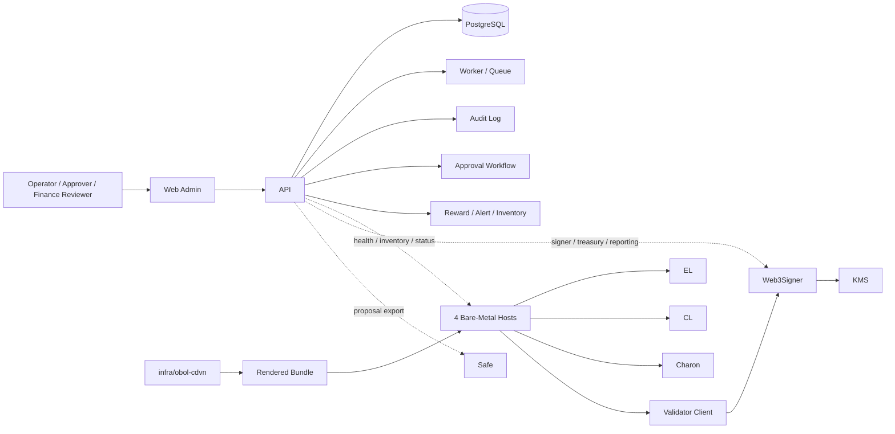
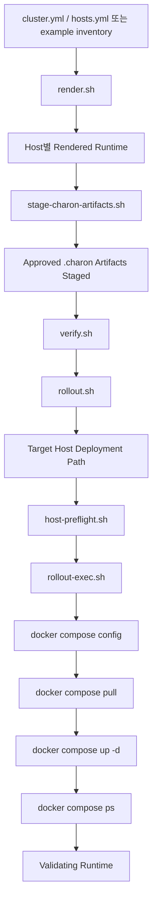
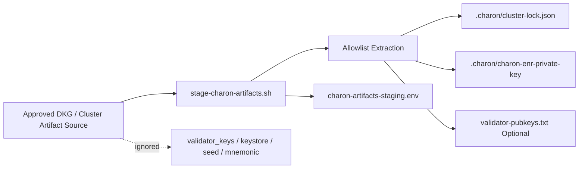
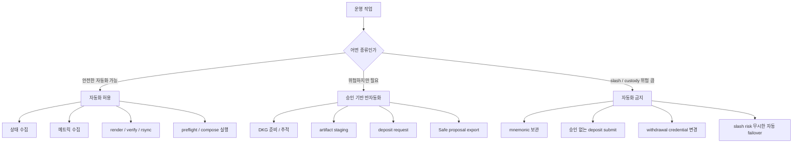
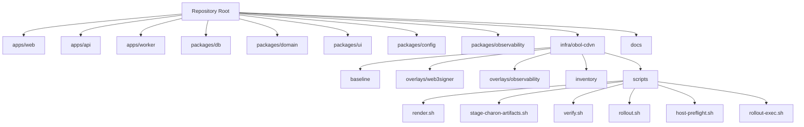
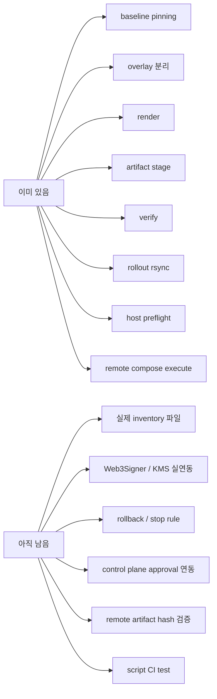

# System Diagrams

## 목적

이 문서는 이 레포의 구조를 글보다 그림으로 먼저 이해하고 싶은 사람을 위한 문서다.

초보자 기준으로 아래 질문에 답하도록 만들었다.

- 이 레포는 어디까지를 담당하나
- 실제 runtime은 어디에 있고 control plane은 어디에 있나
- 배포는 어떤 순서로 진행되나
- 승인과 자동화의 경계는 어디인가
- 레포 안에서 어느 폴더를 먼저 보면 되나

## 1. 전체 큰 그림

### 이 그림이 말하는 것

- 운영자는 `Web Admin`을 통해 시스템을 본다.
- 실제 데이터와 승인 흐름은 `API`, `DB`, `Worker`가 담당한다.
- 실제 validator runtime은 `infra/obol-cdvn`이 만든 rendered bundle이 4대 bare-metal host에 배포되어 돌아간다.
- validator signing은 validator client가 raw key를 직접 쥐는 방식이 아니라 `Web3Signer -> KMS` 경로를 사용한다.
- treasury 실행은 Safe 쪽으로 export 되는 흐름을 가진다.

즉, 이 레포는 단순한 웹 대시보드가 아니라

- 운영 control plane
- runtime deployment automation
- approval / audit 통제

를 함께 다루는 레포다.

## 2. Runtime 배포 흐름

### 이 그림이 말하는 것

배포는 그냥 "서버에 git pull 하고 docker compose up"이 아니다.

이 레포는 더 보수적인 흐름을 의도한다.

1. inventory를 기준으로 host별 runtime을 render 한다.
2. approved `.charon` artifact만 allowlist로 stage 한다.
3. render 결과를 verify 한다.
4. rollout approval을 통과한 뒤 rsync 한다.
5. host preflight를 먼저 점검한다.
6. 그 다음에야 remote compose 실행을 한다.

중요한 점은, 위험한 단계로 갈수록 더 많은 검증과 approval이 끼어든다는 것이다.

## 3. `.charon` Artifact 흐름

### 이 그림이 말하는 것

이 레포는 `.charon` 디렉토리를 통째로 신뢰해서 복사하지 않는다.

runtime에 필요한 최소 입력만 가져간다.

허용:

- `cluster-lock.json`
- `charon-enr-private-key`
- 선택적 `validator-pubkeys.txt`

금지:

- `validator_keys/`
- keystore
- 비밀번호 파일
- mnemonic / seed / raw secret

즉, artifact staging은 "편의성"보다 "경계 유지"가 더 중요하다.

## 4. 승인과 자동화의 경계

### 이 그림이 말하는 것

이 프로젝트의 핵심 철학은 "자동화 많이"가 아니라
"자동화 가능한 것은 자동화하고, 위험한 것은 승인으로 통제하고, 위험이 너무 큰 것은 아예 자동화하지 않는다"다.

초보자는 이 경계를 이해해야 이 레포의 방향을 오해하지 않는다.

## 5. 레포 구조 한눈에 보기

### 이 그림이 말하는 것

- `apps/*`는 운영자가 보는 시스템
- `packages/*`는 공통 코드와 데이터 모델
- `infra/obol-cdvn`은 실제 runtime 배포 자동화
- `docs/*`는 설계와 운영 원칙

초보자가 처음 볼 때는 `infra/obol-cdvn`와 `docs`를 같이 보는 것이 가장 이해가 빠르다.

## 6. 현재 상태와 남은 일

### 이 그림이 말하는 것

이 레포는 아직 완성품은 아니다.
하지만 runtime automation의 뼈대는 이미 들어가 있다.

즉 지금 단계는

- 아무것도 없는 초기 scaffold

가 아니라

- 실제 운영 절차를 미리 구현해 두고, 실서버/실연동만 남겨 둔 초기 제품

으로 보는 것이 맞다.

## 추천 읽기 순서

전체 추천 읽기 순서는 `docs/reading-order.md`를 본다.

초보자라면 최소 아래 순서가 가장 자연스럽다.

1. `docs/beginner-guide.md`
2. `docs/system-diagrams.md`
3. `docs/dvt-cluster-walkthrough.md`
4. `docs/runtime-inventory-guide.md`
5. `docs/runtime-secrets-guide.md`
6. `docs/bring-up-checklist.md`

## 아주 짧은 결론

이 레포는 "ETH Treasury staking 운영을 사람이 통제 가능한 방식으로 자동화하는 시스템"이다.

그 핵심은 아래 두 줄로 요약된다.

- 4대 bare-metal 서버에 같은 방식으로 DVT runtime을 올릴 수 있어야 한다.
- 위험한 작업은 approval과 audit 경계 안에서만 진행되어야 한다.
